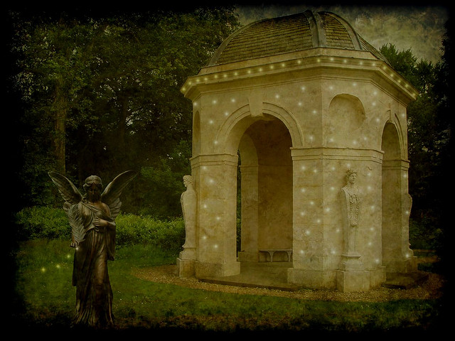

I'm working of the following assumptions:

- You've coded before (i.e. you know what an IDE is, how to create projects, what source code is and what you're actually doing when you hit that "compile button"). If you haven't got that well, there are some very good programming tutorials out there.
- You have a basic knowledge of computer graphics. Very basic. I won't be dealing with 3d maths or anything but you shouldn't freak out when I talk about swapping buffers.

You will need to download a program to edit and compile C#. I recommend [Visual Studio 2010 Express](http://www.microsoft.com/express/windows/). It's free and powerful. It's what I'll be using. If you have the full version then so much the better. Downloading and activating it involves jumping through some hoops for Microsoft and providing them with some personal information ([they think I'm a Polynesian 57 year old unmarried mother of 12](http://www.youtube.com/watch?v=7eIUOUfhoJ8)). Even if you don't follow this guide through Visual Studio is the default development program for Microsoft houses so getting to grips with it is a good idea.

Next we're going to be using the [OpenTK](http://www.opentk.com/) as a graphics library. I don't know why but I've always been an OpenGL fan more than DirectX. OpenTK is a very clean C# wrapper around the OpenGL dll while XNA is basically DirectX. I think I just dig the platform agnosticism of OpenGL more. Anyway. [Download and install](http://www.opentk.com/files/download-opentk.html) the .exe (it installs to ~:/Program Files/OpenTK which is weird for a library but since it's not native, where's it meant to go...).

Just as a verification that you have Visual Studio and OpenTK set up right we'll download a sample project. Yask (Yet Another Starter Kit) is a NeHe tutorial that has been converted to OpenTK. If you have any interest in doing work with OpenGL, [NeHe](http://nehe.gamedev.net/) is the gold standard for tutorials \*. [Download](http://www.opentk.com/project/Yask) and unzip to a suitable project folder. When you double click on the solution (OTKStarter.csproj) file, this will start up Visual Studio  and conversion wizard within that (it was created with an older version of .Net). Once that's done go to OTKStarter.cs and change the **$safeprojectname$** to **safeprojectname**.

Then hit F5 and you should be seeing graphics on the screen. If not... well, check the forums at OpenTK.

**Summary**

- Download and install [Visual Studio 2010 Express](http://www.microsoft.com/express/windows/)
- Download and install [OpenTK](http://www.opentk.com/)
- Download, compile and run [Yask](http://www.opentk.com/project/Yask).

**<edit>** Climbdown part the first

Well I started doing some work with this and realised that (A)it's been a few years since I've done any OpenGL work and (B)this is OpenTK, a wrapper around OpenGL and not actually OpenGL. So while the fundamentals are the same there's a bit of a learning curve I'll need to adapt to in order to actually be comfortable talking about this stuff with any authority (e.g. I'm used to a main loop style of game whereas OpenTK uses an event driven model) i.e. not making mistakes all the time.

So I'm going to use the 1.X series of posts in this category to work my way through some OpenGL tutorials with OpenTK and get (re)acquainted. This accomplished I'll move on to talking about and putting a simple game together.. maybe.

\*If you're going to follow the NeHe tutorials. Well they were written for OpenGL, not OpenTK and at this stage, they're 10 years old...

Image from Flickr user [Eddi 07](http://www.flickr.com/photos/spiritual_marketplace/)
