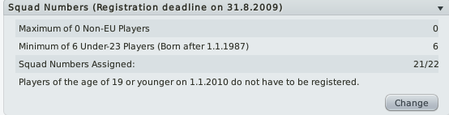

_"What do you mean Basque isn't an actual nationality? Are you sure? They've got their own national team don't they."_ So the Spanish league has some very specific rules on who can play for your team. _"How is it possible that a Brazilian is eligible to play for a national team of a region within Spain, but not actually be eligible to play for Spain or any other EU nation?"_ I'm getting dangerously close to losing my cool with this pompous Castillian paper pusher as I'm trying to get my future captain registered in time for the season. _"So there's no way we could consider Basque as a separate nation then, just in footballing terms? Hello? Hello?" \*_

That's right, no No-EU players. Do you remember my hoped to be captain, **Marquinhos**? The Brazilian. Looking at his profile, he's also listed as Basque. As far as I can tell my predecessor was either an idiot or a fervent Basque nationalist.

Either way, I can't play this guy and I need to offload him sooner rather than later as he's on the highest salary of the club. Unfortunately no-one wanted him so I had to terminate his contract if I wanted him out. Yes I know that this costs the same has having him on the books all year but I don't want a player getting unhappy because he's not playing and affecting the rest of the team. I do wish there was a "Wrap your arm around the player's shoulder, explain that you think he's a good player and a great lad but that you can't  play him for us because of an administrative mess up" option. As it is I'm stuck with the blunt tool which is "Terminate Contract". It makes me seem to my players that I'm some sort of arbitrary nutjob, letting a first team player go for no reason.

Football Manager is very much in the philosophical camp which says that your motivations are irrelevant, only you actions and their outcomes count.

I also picked up another two players. **Nauzet Martínez** as a non scoring forward (FC AM R) who I'm planning on using as a wide attacker cum link player.

And **Rafael** a promising renaissance painter.. wait no. A 16 year old defensive midfielder I spotted at the Spain Trial Day. I'm just going to drop him into the U19's for now and see if he's development material.

As far as I can tell the entire league structure is set up to force smaller teams to act as unofficial feeders of young local players for the larger clubs. The next league up lets you have 2 non-EU players while the top league allows 3 non-EU players. You are required to have young, local (EU) players which would then be snapped up by larger teams.The top teams don't even have reserve squads. They have secondary teams in the lower leagues so you can't get their B team or youth players out on loan as they're playing in active leagues.

It's almost as if they want to prevent smaller teams growing and developing and only really care about the big teams. Never mind my persecution complex though, I'm here to win the league or get fired trying!

\*Just to be clear to anyone out there with stronger opinions on this than me - I'm not saying yes/no or anything else about this situation in the real world. It's a fake player in a game world people.
