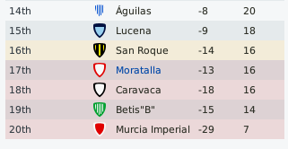
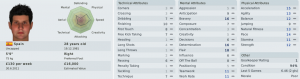
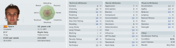
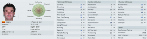
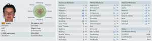
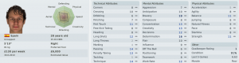

_"S_o what do you mean y_ou don't know where you are?"_

Somehow I don't have the greatest confidence in my scout.

_"It's got a population of over 40 million football mad people and you say you can't find any promising players?"_

Maybe I'm being too harsh on the guy, I'm paying him £240 a week to go to a South American country and watch soccer matches. Maybe he's developed a crippling addiction of some sort which prevents him from attending the matches. I imagine him sitting in a colonial style veranda sipping Pernod and toking on an opium pipe.

_"You heard about a promising 12 year old in_ [_Ushuaia_](http://maps.google.com/?ie=UTF8&ll=-54.686534,-68.049316&spn=7.54994,18.149414&z=6)_? I can't say I've ever heard of it. No joy though?.... Frostbite you say?"_

I'm glad to say that we continued our good form from the end of the first quarter of the season.

- 10 games
- 3 losses
- 5 draws
- 2 wins
- WW D LL DDD LD

The losses were pretty heavy (0-3, 0-3, 0-2) and after the second consecutive I was starting to get worried again so I clamped down on all forays across the halfway line and we ground out three painful, painful draws. It's no surprise we've got such a bad supporter turnout if this turgid dross is all they can expect. Not for fans of the beautiful game but it is keeping us in touch.

The standout match was the last match against **San Roque.** I had tried out a right back from the youth team (17 year old **Antoni**, really a CB) who was very fast (pace 18, acceleration 17) but who couldn't defend (tackling 4, positioning 1). 2-0 down with young Antoni at fault for both. First missing a header, second, playing the strikers on. José & Ortero came on in the second half and we came back to draw 2-2. It felt like a win

We're still in the relegation places, but at least now it's only on goal difference and our form is trending upwards. I feel hopeful rather than confident that I can pull this off.

Player impressions so far:

As far as I can tell **Calderón** is one of the main reasons for the improvement in performance. He's playing well as both a lone striker and as a target man. Linking well with the wide players and pulling the defenders around. When he was injured during our second win the team's form dipped as none of **Fernando**, **Rubén** nor **Pedro** can play that role as well. He hasn't managed to get back fit enough to play regularly so maybe after new years we'll see some more from him.

As backup strikers go **Fernando** isn't too bad, except that he also has yet to score. He's still not getting enough game time to get into a groove and when he is on the pitch he just isn't up to the pace of the game. It doesn't help that he's surly and unhappy about the performance of the team. If I can get him motivated and involved with the team he could yet come good

The flop so far has been **Nauzet Martínez.** The non assisting, non scoring, non tackling winger cum striker thinks I underrate him. He's managed no assists, no goals and has awful tackles/passes/dribbles per game rating. According to his stats he should be one of the best players on the team but it seems like he's just lazy. I'm inclined to think that I was lucky to only sign him on a one year deal.

Given the poor performances of **Nauzet Martínez,** the leagues smallest winger **Girona** is playing pretty well. When I say small, he's tiny. Only 5 foot 3 inches tall, at 64 lbs, this guy is described as "diminuitve winger". Not a fantastic player stats wise but he does seem to put in good performances.

The surprise package is our 16 year old winger **Ortero.** He's currently the clubs leading scorer(not a huge achievement I know) and he is consistently turning in solid to good performances. He hasn't dominated any single game but is good in all of them. Of course there's plenty of larger clubs scouting him now so I may have to consider selling to balance the books.

Our captain fantastic. **José Antonio Díaz Ruiz** is an absolute disaster. He hasn't started a single game (there are plenty of other strikers ahead of him) and he's been bitching and moaning all season. I took the captaincy from him and passed it on to **Miguel Ortega** who is the real leader on the pitch and have since shipped **José** out on loan with a view to selling him at the end of the season.

One **José** **leaves and another José** signs up. I picked up a good looking target man style striker (**José**) and an attacking midfielder **(Daniel)** to see if they can cover for the injured **Calderón** and provide a bit of midfield flair respectively. They were free agents, their wages are next to nothing and the contracts are until the end of the year only so if it doesn't work out I've only lost a couple of grand on them.

Speaking of money matters, the clubs value is estimated at somewhere around £400,000 by the game. This seems somewhat 'inflated' to me so I look throught the valuations of the players and I find **Pedro,** the rubbish wonderkid. He's 19, pretty fast, good flair but no positional sense and worse than average finishing. Somehow he's rated as being worth £200,000. He is either being massively overvaluated by the game engine or he's got some unplumbed hidden ability which he's craftily hiding away beneath his mediocre stats and performances.

I can only wonder if there's any way I can trick one of the other clubs into buying him? So I've started playing him towards the end of games we're winning and hoping he'll grab a few easy goals.

Overall the squad is nicely balanced but there are just too many strikers who are very similar to one another. **Pedro, Rubén** and **José Antonio Díaz Ruiz** are all so similar that I can only really justify putting one of them on the squad with **Calderón. **Rubén** is definitely the best of the three but **Pedro** has this weird massive valuation which compels me to play him in the hope of a payout down the line and **José Antonio Díaz Ruiz**, despite his fantastic name and status as captain really just isn't up to it.**

****Ancor ,** Florea Iacob and Cavaleri** have gelled nicely into a solid defensive unit. **Florea** in particular is very solid at the back. Nothing fancy just solid tackles and good clearing headers all through most games. **Cavaleri** is a bit more lightweight but a good complement to the hulking Romanian.

**Daniel Léon** and **Augusto Guerrero** have been disappointing. **Léon** is average and not bad enough to drop from the squad (though I did disastrously give **Antoni** a try out there) but he just hasn't lived up to the promise from preseason. **Guerrero** on the other hand has tended to be a liability. With a more defensive outlook I've been playing **Pablo** at left back for extra solidity.

I've kept up with the huge number of triallists in the hope that some of them will pan out. They don't cost anything and it's you get a better impression of how good the players actually are. Pity it's such a tedious process to actually set them up. Raul Abseladm has really displayed all the perceptive nous and acumen I expected from him. He's constantly suggesting I look a this or that 5rd rate player as "a bright prospect for the future" or "could really add something to the team". There's one 17 year old he's suggested to me 3 months in a row. I'm inclined to think it's his nephew...
