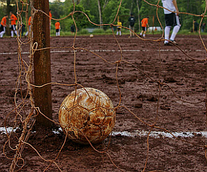
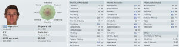

So, that didn't go too well. Not well at all.

I won't lie, during our 4 game losing streak I _wanted_ them to lose. Having spent the first seven games ranting and raving from the sidelines, shouting, screaming, pleading, imploring I sit slouched and brooding in my dugout. . All the emotion, hope and energy gone. No more tactics forthcoming than "I don't care, just boot them off the park. See if that works. Tikki-takka my arse" .

I was hoping and praying for an absolute hammering which would see me fired and allow me to go off and find a proper club. Some club where I wouldn't suffer the ignominy of losing two or three nil to awful teams. Playing awful football. Some club where the players worked harder, had better touches, control and actually try passing the ball professionally.

Then **Calderón** grabs a breakaway goal for our first win of the season and suddenly there's hope.

Hope that my Spanish adventure won't be over in the first year. Not knowing whether to laugh or cry I look back over the first 9 games and with a new sense of perspective, start planning for the next 29.

- 9 games played
- 6 games lost
- 2 game drawn
- 1 game won
- LL D LLLL W D

We're sitting 17th of 20 in the league. 5 points from a possible 27.  It's still relegation form but that win and a draw at the end are promising. Can we actually pull together and inch our way out of relegation? Actually, given that there are 3 teams with less than points than us (and a few more in single figures) I suddenly realise that if we can just scrape out draws and grab the odd win, we can do it. It won't be pretty but it can be done.

I had started out with grand plans of an expansive 4-5-1 with attacking fullbacks, a solid core of 3 defensive minded midfielders, 2 inside forwards on the flanks with a single target man. This didn't work as the midfielders couldn't control the midfield, the wingers can't pass, shoot or track back, the target man can't hold the ball and the fullbacks just stayed back to cover the defence leaving the midfield too narrow.

When I realised how many strikers are in the squad I tried for an attacking 4-4-2. Again the full backs marauding forward,  two defensive midfielders, flying wingers, one target man and one striker dropping back to link up as well as attacking from deep. Queue even worse results as we're getting outnumbered and overrun in midfield, the strikers were isolated and the defenders really, really struggled.

After getting repeatedly spanked I have changed to a defensive, kick the opposition style of 451 and hope for a goal on the break. This has worked a bit better so far with one draw and one win. My early enthusiasm for attacking, free-flowing football blunted by limited resources and necessity to _just stop losing_.

I had tried encouraging and then shouting at the players. Some players don't like being given out to as it hurts their feelings. And there I was expecting players to actually want to try and win matches. Now **Adrián Martinez** has left by mutual consent. When you're playing poorly, missing training and can't accept a warning, then it's time to go. The team don't like criticism of other coaches and like me to be nice and friendly. I think I've inherited the care bears.

2 goals scored in 9 games is pretty awful as well. **Otero** the 16 year old winger from a free kick (for the first draw) and **Calderón** with a break away goal (for our only win). If I can manage to not get relegated I'll be doing very, very well. So what I really, really want is someone who can score regularly or a forward which brings the wingers into play a bit better. My hopes in **Fernando** are wilting. He's too lightweight for a lone striker and he hadn't had much of a chance as a supporting striker so far so he's gone off in a huff. We could also use a central midfielder who can actually pass the ball. Mine are all defensive blockers but can't pass for crap.

On the plus side, after the **Marquinhos** debacle I managed to sign a half decent Argentinian/Spanish central defender **Cavalieri**. Not that big fast or strong, but neither is he particularly bad at anything. He's struggled so far as he's new to the squad, unfit and because I've had to rotate between Rivero and Pau as central defensive partners and neither are very good (first choice **Florian Iacob** is out injured)

Off the pitch, things haven't been going too well either.

Do you remember at the start when I said the club was almost bankrupt? Well apparently I was lied to (or I didn't read the financials properly). The club is totally bankrupt. £120,000 in debt when I joined, down to around £100,000 now after the friendlies in pre-season. The real problem is that no-one wants to see us play, so we've no prospect of any sustained income. We have a home turnout of around 70 and when we play away I get to see "Club expects record low turnout" type notifications. Our main source of income is "fund raising" with between £6-8 thousand coming in per month. If I manage to keep the club up I'll have to come up with some way of actually generating income.
