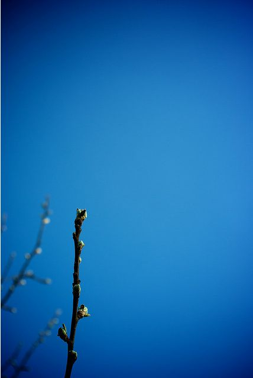

 It's a crisp spring morning in the hillside town of Moratalla. Mist drifts slowly over dew encrusted fields while birds flutter from branch to branch. The glow over the eastern horizon shows the sun will be up soon. Bakers vans and post men move through the quiet streets. Their noises both muted and incongruously loud against the surrounding quiet.

In a quite cul de sac away from the main street a man is loading his bags into a rented car.

Breath fogging up in the cool air. Strong coffee impels his muscles. He stops only when hears the crunching of footsteps on the gravel behind him. Without turning he says _"It's no good asking again, I'm leaving. You're better off without me."_

_"Jess senor Murphy we are thinking that too. We just wished to thank you for what you have done for us. It is only a pity you are not a better manager"_

Smiling wryly the man climbs into the car and drives away. Only stopping to drop the house keys from the window as he speeds away on the clear open road.

So, where did it all go so wrong? _Going wrong_ implies that it went right at some stage which I'm not sure is true this season. While last season came finished with a great run of wins this was a struggle after the first 9 games.

My mistakes (as far as I can tell)

1. My expectations were completely unrealistic. Taking over the team I was dreaming of getting promoted within two seasons. I really thought that the team had the potential to get up the leagues and played as if they could beat anyone. Unfortunately this was a massive overestimation of the mostly part-time players, the resources of the club and my own abilities.
2. Some players I dropped last summer should have stayed with the squad. Specifically **Caballero, **Luis Miguel Girona**** and **Calderón**. While they weren't world beaters, **Caballero** and **Luis Miguel Girona** would have provided valuable competition for the two wide players who underperformed all season (**Martinéz** in particular) and **Calderón** would have scored goals. True, he was injured half the time, but the other half of the time he was winning games for us.
3. The players I brought in weren't good enough. Where do I start with this one? **Armiche**, **Gavlez**, **Cases**, **Nauzet Martinez**, **Ramonas** and most disappointingly (and arguably of greatest impact) **Inglesias**. The boy wonder to be got two goals all season. Too frightened to succeed. My previous experience of playing with a scouting program meant I was used to brining in top quality players. As it was, I could only find occasional good quality free transfer willing to sign for a manager at a club with such a low reputation. The clubs crippling debt meant I couldn't  buy anyone either.
4. I didn't play my tactics right. I defended against worse teams and I attacked against better teams. Some of this wasn't helped by the assessments of our chances against upcoming opposition. We were always said to "face a difficult challenge" and it becomes hard to judge how to play when you're constantly the underdog.
5. I certainly didn't motivate the team correctly. I was too conciliatory, too eager to keep morale up and keep players happy. When you're fighting against relegation you don't want happy, content players. You want players who want to fight, you want players who hate your guts but are willing to go out there and prove you wrong. We were meek against big teams and complacent against small teams. Which meant that we lost the big games and drew the easy games.
6. I didn't keep an eye on the other teams, or what was happening elsewhere in the league. Most of the time I was barely aware of who we were playing. Speeding through matches with only minimal changes to the tactics, not taking into account opposition strengths or weaknesses. This is in part how I'm used to playing, with players who are miles better than the opposition. I rarely checked my own player's status and persisted in playing them even if they were in poor form, convinced that their slightly better stats would compensate. Maybe it was just not caring enough about the individual matches. All that attention to detail seemed like so much _work_.

If I want to reassure myself I can point out that I managed to keep them in the league for a season longer than expected, with tight control over wages and no outlay on transfers. Plus, the incoming manager should make some profit selling off **Inglesias** if he can find a buyer. But that's scant consolation as I had hoped for so much more.

I found in the last few games a very weird behaviour. The u19 right back **Gustavo Santana** was playing and his passing was impeccable. Long balls over the top, short one twos. But his passing stat is 1. Surely this means he should be shanking them off into the crowd on a regular basis not having a nearly 100% pass rating? Maybe it was some sort of stat underflow where the game thought it was 20 and not 1?

I spotted a few of the reserve teams for the large upper league teams have non EU nationals in the squads. I know I've given out about this before but these teams are such a disruptive influence on the lower leagues. They never get promoted even if they're far better than the other teams in the league, they have effectively infinite resources and now it seems they don't even have to play by the same registration rules as everyone else in the league? I'm not surprised you don't see lower league teams coming through into the upper leagues in Spain if they can use their reserves to keep them down. -- end of paranoid rant...

Also, in this alternative reality Liechtenstein kick ass. They've just beaten Ukraine 3-2 in a friendly. Taking a quick look at the players and while they're not legendary there certainly are some world class players in there. Oh the vagaries of a virtual world.

It's the first time I have ever managed a team which were relegated. In 8+ years of playing I've never been here before. Usually if a season is going down hill as this was from before Christmas I'll bail and start a new game. The only reason I stuck with this one was that I was keeping this blog. While not entirely pleasant it is a new experience. I knew half way through the season that we were in trouble. I couldn't buy my way out and my encouraging approach to motivating was a failure. I just couldn't stop drawing and losing consistently which led to a desperate chopping and changing of tactics and personnel which probably did more harm than good.

I will remember the 2-2 draw from the turn of the year last season which I think kick started that great run in the new year and I will remember the 4-3 victory which promised so much but which really displayed how poor we really were. I will remember the feeling of powerlessness as the team slipped away. As they just drifted out of contention after a series of poor results in the second quarter of the year and never recovered.

Out of curiosity I fired up the FM Genie Scout program and looked at the saved game from January this year to see if there were better players which I could have, should have signed. In short, no. There were no players willing to sign for me who were actually better than the players I already had. Maybe it would have been different had I checked last summer with all the free agents (spotting good players first is half the battle when you're a club with a low reputation). As all the players were fake the Scout program was mismatching them and as a result was showing me mostly incorrect player names so even had I wanted to I couldn't have used it to cheat during the game.

Right now, I'm feeling pretty burned out on Football Manager. I've tried starting up a similar game with French or German lower league teams but I can't even get past the "Select your Team" screen. Just looking at the line ups of unfamiliar players. New virtual personalities and aspirations all seems so... so _tiring_. I'm sure I'll do this again sometime, but right now I'm calling it a day.

I'm half thinking of doing something similar with a game such as Empire: Total War (or Medieval) as I tend to have the same issue with that as I do with Football Manager. i.e. once it settles down or starts going against me I just quit. And being forced to complete for content for a blog might be fun. Except that the Total War games can't be run in the backround as you're doing other work like Football Manager games can. Civilisation IV or Galactic Civilisations (funny, I never noticed the blatant rip-off of the name before and the gameplay's very similar) just don't strike me as being interesting now. And I can't find any other games which allow you to make up your own narrative. Maybe X-Com? For the next while though I'm going to try and play through S.T.A.L.K.E.R.: Shadow of Chernobyl. Having just read "Roadside picnic" I'm inspired to pick up my last game where I've just reached the scientists station at Yantar.

Yes, I think dragging my irradiated sorry butt across a nuclear, mutant infested war zone with on unreliable weaponry and limited ammunition will be a nice relaxing break from FM2010.

<edit>

I've just found a fantastic, [essential guide to lower league management on the SI Games forums.](http://community.sigames.com/showthread.php/110062-FM09-Heathxxx-Management-Approach-(Lower-League-Edition)) (just cancel the popup login requests)

Picture from flickr user [e\_walk](http://www.flickr.com/photos/walker_ep/)
