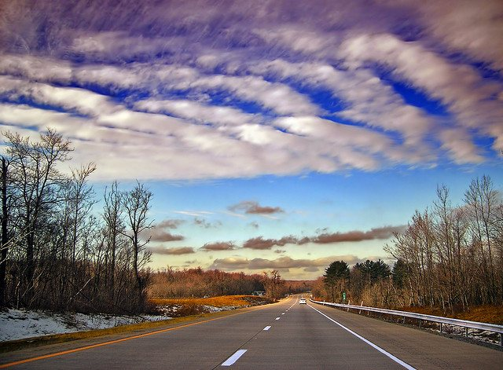

So this morning I had a two and a half hour commute. There's nothing like a 300km journey on motorways to let your mind wander. I found myself realising that if you were to make a 150 minute long game with exactly the same rules as driving (a) you'd have the worlds dullest game and/or (b)you'd have a commentary on the nature of travel.

Basically driving on a motorway consists of following a set of simple game style rules:

- Is the car moving fast enough? If not go faster, if too fast, slow down.
- Are we too close to the car ahead. Pass or slow down.
- Lane changing excitement!
- Super extra game play element available at the coffee and Danish scummy half way stop.

I found myself thinking about the nature of travel in the real world as well as in simulated environments. In the real world most travel is not that interesting. You have a destination, follow a set of rules (rules of the road, airport regulations, train timetables) and after time passes you arrive at your destination. During that time you are either continuously in control of the trip (driving/walking/cycling) or not (planes, trains, buses). If not then you have control points at which you can choose whether or not to take that particular vehicle of transport.

As the time passes, so does the scenery. Sometimes this is obvious (from a car or bike) but sometimes it's not (night time on a plane). I remember making the Cork-Dublin bus trip when I was in college and it was always a calming experience. I knew that once I was on the bus I had no responsibility other than being on the bus. And the dusky landscape giving way to neon-lit city suburbs was quite a transition.

Not to get all [Alain de Botton](http://en.wikipedia.org/wiki/Alain_de_Botton) but in travelling the traveller in changed. It may only be the location but often the enforcement of spending time _just travelling_ gives you a different perspective when you arrive at your destination. For example, last January I was in [Siem Reap](http://en.wikipedia.org/wiki/Siem_Reap). We arrived there after travelling by bus from Bangkok. I guarantee you we had a different experience to those who arrived direct from the airport (I won't make any better/worse, more authentic/pampered tourist type comments but they were different).

Travel in games is different. First of all there's plenty of games which have no concept of place. How do you travel in pong? How do you leave home in a football management game. The concept of here and there makes no sense in this context. What does occur is that as you spend time with the game you change the state. Someone who's won a game of Pong 21-0 has _"moved away"_ from the 0-0 scoreline. That's a whole other blog post about the progression of states in the player of a game or how the act of playing changes you and forces you to experience.

I'm thinking more about travel as presented in games where location does exist. At one extreme is [Canabalt](http://www.canabalt.com/) where you are forever travelling. Indeed it's the whole purpose of the game, forced to run, run, run for an unknown reason. At the other game is something like tower defense where you're totally stationary and the attackers are travelling towards you.

In many games travel is not available or resolved by instant transportation. For implementation reasons it just wasn't possible to have that amount of scenery and landscapes created & stored, especially if it isn't relevant to the main game. Why waste resources on developing content if 99% of players will never see it.

I like the Mount & Blade approach of having a little figure travelling across the landscape. This allows some nice gameplay mechanics of tracking enemies and scouting out armies. It's got a default in game music playing but I always imagine the travel music from [Conan: The barbarian](http://www.youtube.com/watch?v=XUyOJc3V9Wk&feature=related) playing. It's a nice compromise between forcing the player to sit through the 2 weeks of real time which would be required to cross the continent (flight/train simulators notwithstanding - you freaks) and just having loading screen with "time passes" flash up. You still get a sense of actually going from A to B being a big deal in a pseudo-medieval world.

And this is the sort of rambling post which spills out when I'm sleep deprived.

Image from flickr user [Nicholas\_T](http://www.flickr.com/photos/nicholas_t/)
