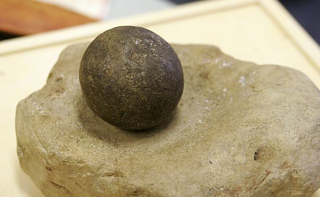

Well, 3rd week of January resolution. I'm going to track my time and the task I work on in the office as accurately and honestly as I can.

Currently we've got a very rough cut timetable system where everyone fills in their time after the fact using very broad work categories. 99% of the time this works absolutely fine. Last week we had a request to give a total amount of time for a particular project. Of course no-one on the team was tracking this one project distinct from the others so the best we could do was dead reckoning. It's definitely wrong but it should at least be in the right ball park.

A co-worker turned me on to [Grindstone](http://www.epiforge.com) which is a fine granularity recording mechanism for windows. You set up tasks, hit the start button and away you go. At the end of the day/week you can get a bunch of nice reports on the time you spent on the different task.

The only difficult bit is to be honest with it. That time you spend on youtube? You'll be tempted to mark it as "working on defect" but you're only tricking yourself.

I would hesitate to recommend it for project managers to enforce it on your employees because it rely's entirely on the honesty of your staff (which shouldn't really be a problem) but more than that, it gives the developers a very big brother feeling. It's not enjoyable working if there's no wiggle room and if developers can't even pretend they enjoy their jobs, then they won't be very productive.

Image is taken from [commons.wikimedia.org](http://commons.wikimedia.org/w/index.php?title=Special:Search&search=grind+stone) (resized and resampled)
