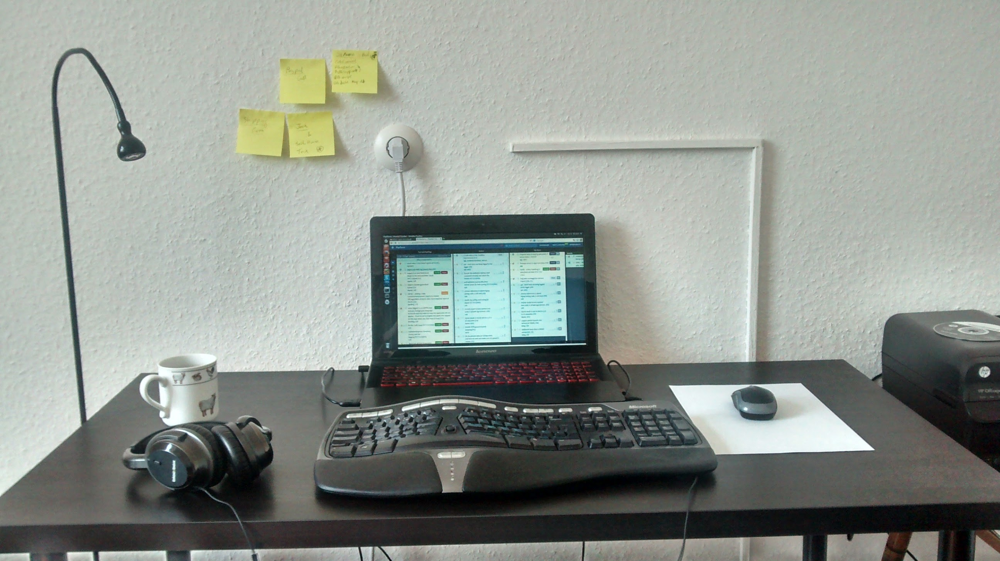

So, I've been using split keyboards for about 2 years now. I had been using a MS Natural 4000 for about 12 years but moving to 100% home office I was getting bad tennis elbow and started looking at smaller boards.

Initially I was more interested in something like the HHKB , smaller and without arrow keys to force me to use VIM properly and splits just seemed too "weird" to me to be practical.

I don't remember when or why (I think it was probably cost related) but I decided to try an Iris.

I stayed on this for about 9 months and realised I didn't need the number row (replaced by a dedicated numpad layer)

Of course, then my pinkies were not sitting quite right on the iris. Somewhere between the bottom and middle rows so I looked at something with a bit more stagger and found the kyria. (splitkb.com). I built a"full sized" one initially an again used it for about 9 months.

I was really happy with this so of course, I started getting carpal tunnel from overusing my pinkies and ring fingers. So thanks to the magic of programmable keyboards I changed my layout so they are less used. This meant that I wasn't using the outermost columns at all so I built me a new kyria without these.

And if you squint at that last photo you'll see I only have 4 thumb keys (2 per side). So now I want to build another kb, purely for aesthetic purposes ([https://splitkb.com/products/aurora-sweep-pcb-kit](https://splitkb.com/products/aurora-sweep-pcb-kit))

At this point it's more of a hobby than a necessity (soldering is basically knitting for nerds)

That said, ergonomically the 2 big wins are split and programmable layouts. Everything else is just affectation. Even with this, sitting and typing is baiscally bad for us. Exercise people!!
