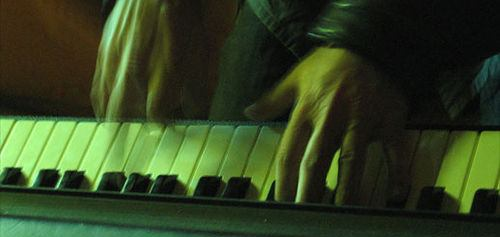

_You know what Bill Shankley once said? He said "A football team is like a piano. You need eight men to carry it and three who can play the damn thing."_

_I like to think we're just like that except that right now we've got ten carriers and maybe one player. And that's ok, because getting started, the first thing you want to focus on is not getting beat. After that we can work on getting some wins but right now it's about getting the lads to gel together._

_That being said, I need a player. I mean a proper player. And I've found him. I just need to talk to the money men and maybe then he'll sign up._ [Stevie Millar](http://spurious-logic.net/wp-content/uploads/2011/04/stevie_millar_001.jpg) is our record salary signing and given a reasonably injury free season he should see me promoted this season. He looks like he should work best as a winger but I can also see him in an inside forward role. I'll have to make sure the fullback behind him is defensively solid as he won't provide much cover. I know that from a higher league perspective that he's too mentally weak to be a top-class player but I think that at this level, with his combination of good technical skills and physical attributes he should be head and shoulders above the rest of the league.

In longer term news the 16 year old keeper, [Louis Earl](http://spurious-logic.net/wp-content/uploads/2011/04/louis_earl001.jpg) who's probably better than my first choice keeper, Ramm, has signed up for us. I like to think I'll be able to give him a couple of starts over the season and hopefully he'll be our long term keeper. If he's already this good, then he could develop into a fantastic player.

Match Reports

 

### Game  4: A Farsley 0-0

Both of the new players go straight into the first team (Earl on the bench) for the match against Farsley. I take a quick look through their teams sheet and don't see any outstanding threats. Well to be honest, I don't see any details on the players at all so I'm hoping they're just too bad to register. Mindful that we're going into the game somewhat blind I set up in a defensive 442, telling the players to counter attack and to direct our long balls towards our beanpole striker, Karl Jones.

In a stupefyingly dull game, we're still 0-0 after 55 minutes. I've resorted to sipping for my "special" hip flask and I decide to try a 4-3-3 with McManus, Henderson and Millar all playing up front. After just 10 minutes even in my state I realise that they're now passing around us and quickly change back to a standard 4-4-2. The whole game ends 0-0 and despite playing quite well there weren't too many chances overall.

### Game  5: H Corby 2-0

I've decided to give Louis Earl a start because, well, he's got to make his début sometimes and  what better time that against the newly promoted Corby? I set the team out in an attacking 4-4-2 and tell them to retain possession by passing to each other. You'd think I wouldn't have to tell them that, but I do.

Earl is not very convincing initially, nerves causing him to drop a couple of long shots and he makes one unorthodox save with his feet but still he keeps a clean sheet. In extra time of the first half Henderson picks up a through ball, bringing play towards the right corner flag. He cuts the ball back and Andy Dunlop cracks a shot in at the near post.

Corby go at us from the start of the second half. With two good chances in the first ten minutes I tell the team to work on holding back and then attacking on the break. Corby's attacking impetuous fizzles out and the game drags on until Yates (one of several condition enforced subs on 70 minutes) scores a nice placed finish after picking up on another through ball.

### Game  6: A Hyde 0-2

Hyde? I don't actually remember the game against Hyde. All I know is that we lost 2-0 away to Hyde and that we didn't play well in the loss. Honestly my book of notes on this game is just blank. Totally blank. This annoys me because you learn more about a team from their losses than you do from their victories. Oh well.

### Game  7: H Droylsden 0-0

Looking through the Droylsden lineup I see their keeper is very poor so I set all my forwards and midfielders to try lots of long shots. Despite this all the easy saves and balls flying over his head onto the road beyond the stadium must be helping his confidence. They didn't manage a single shot on goal during the entire first half and ours are so off target that there really isn't any action to speak of

The finally manage to get some shots on target in the second half and despite shifting players and trying to pass into the box the game still ends up 0-0

### Game  8: A Eastwood 4-2

Early on in the game Andrews concedes a soft penalty. This referee seems to be whistle happy so I set to the team to attacking and tell them to 'get ball forward'. If there's going to be free kicks I'd rather they were happening down the other end of the pitch.

Midway through the first half Eastwood have one player sent off for an innocuous foul. Shortly after Jones picks up a loose ball in midfield and passes to Yates. Yates dribbles past his marker to put McManus through one on one with their keeper. McManus shoots confidently to score his first ever goal for Blyth.

McManus quickly adds a second after again being put through on goal, this time by Jones.

Five minutes later Eastwood score a breakaway goal through  Dale. Pure lack of concentration by our defence allows them to tie the game.

At half-time I reassure Andrews that I have faith in him and send everyone out with the same instructions. Attack, attack, attack.

Yates picks up a poor clearance, dribbles down the right and puts in a fantastic cross for McManus to climb in the centre and meet for his hat-trick.

As we're leading the game again against ten men I pull the team back to counter-attack.

At 60 minutes we score again with Yates again the creator. This time crossing from the left to pick up Wright's diagonal run into the box for him to head home.

### Game  9: A Vauxhall. 0-0

There's no action to speak of in the first half with the exception of Karl Jones flying around the pitch and getting a yellow card for his efforts. At half time I tell him to tackle more carefully so, of course, on 60 mins he dives in two footed into a tackle and gets a red card.

We go to a 4-3-1-1 and keep on attacking. The agressive approach almost works as we have more and better chances with just 10 men than we had with the full 11. One bright point from this game is that Louis Earl is playing very solidly, making a number of good saves and interceptions.

### Game 10: H Solihull Moors 4-0

This game started with a bang. After just two minutes Millar picks up a loose ball, races to the byline and crosses for Yates to loop a header over the keeper. Millar then keeps up this level of performance along the wing and also coming late into the box a number of times and winning a _lot_of headers. On 30 mins he heads a ball in midfield back to Joyce, picks up the return. Passing to Yates on the left touch line, he keeps on running for the one-two and then fires the ball _against the keeper_ to score a second goal after if deflects in.

And... I'm not sure what happened for the next boal but Karl Lyons picks up a through ball from Steve Harper and scores a third on 33 mins. Stewart Potter rounds off a 4-0 victory with a penalty in injury time.

And with that the first quarter of the season is done.

I've come to realise that, much like Michael Coar, I'm really getting to dislike Alan Davies. There's just something about him which bugs me. His complete inability to evaluate players or tactics is somewhat of a liability given his position. Having scouted for staff no-one wants to join and his mutual termination clause is around £10,000 because he's on a 5 year contract. So I'm stuck with him for now.

We're sitting in 6th, just outside playoff places, 4 wins, 4 draws and 2 losses and the team is knitting nicely. Fourteen goals scored, six conceded is a nice ratio even if 8 of those scored are from just two games. As I said before, if we can score, we can win. The new arrivals, Millar and Earl are playing well and settling into the team nicely. On the other hand, that one hattrick notwithstanding McManus has been underwhelming. Maybe I'm just not playing him correctly? Either way as the second highest player on the team I do expect a bit more from him.

A quarter way through the league and the table looks [thusly](http://spurious-logic.net/wp-content/uploads/2011/04/league_table_q1_2009.jpg)

Image from flickr user [filpeferreira](http://www.flickr.com/photos/filipe93/)
