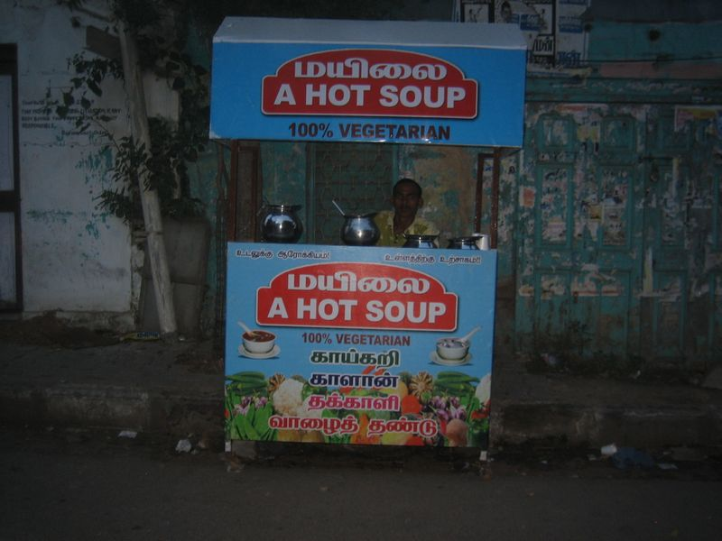

The worst thing about leaving your blog for a while, is that you stop writing.

I think that may rate as the most obvious statement I've ever made on this blog. As I said before, "Getting started is the hardest part" and taking an extended leave is much the same as stopping and restarting.

So, since my last post there's been more production issues and rushed released (there couldn't be any correlation between those two.. naah.. never). I've also discovered [bandcamp](http://bandcamp.com) which I can't recommend highly enough. The moral aspect of supporting artists directly aside, it's a fantastic way to discover new music.

Professionally, it's been lots of fun with some pretty steep learning experiences but from the middle of July I'm going to Chennai for six months as a team lead. At the very least that will be different. I'm hoping to keep up with the blog a bit more depending on the workload.

As you may guess from the title I've been watching too many medical dramas recently (namely House and Nurse Jackie).
