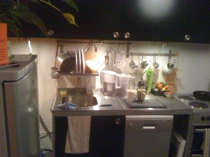
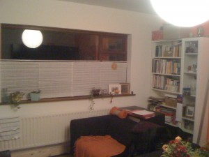

So, again I've been neglecting posting here but I've spent the last 6-8 weeks converting a garage into a living space and bedroom.

And what I've learned is:

\--that everything will take longer and cost more than you expect. If you schedule for 4 weeks, expect 6 for 95% of the work to be done and a remaining 6 weeks to get around to doing the last 5% yourself.

\--Take your initial budget and add 10% and you've got the starting point for your expenditures.

\--IKEA products aren't so much cheaper than other brands but they are far higher quality than other brands at the same price

\--If you go shopping in IKEA plan ahead so you don't end up coming out with more than you expected. (You will buy things you weren't planning on anyway but this helps to minimise it)

\--When you have the builders in, providing them with timely coffees, teas and snacks will keep them happier and working for longer

\--When the builders are working stay out of their way, but do check on what's happening regularily to head off any nonreversible mistakes

\--If you're sharing resources like space, heating or electricity then you need to be 100% sure that all stakeholders know exactly what's being shared, what access is allowed and what access it not allowed.

You always hear about software being like construction, so the reverse is also true. Planning is vital, testing is nonexistant and your workers can be unreliable. If this is your project I hope the house doesn't fall down.
