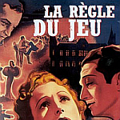

So inspired by the [www.runofplay.com](http://www.runofplay.com/category/vercelli/page/1/) in chararacter narrative I'm going to try my own. I will take some small team and do my best to get them up the leagues. This is probably doomed to either fizzle out miserably due to a lack of time on my part or result in successive relegations and bankruptcy for the club following a catastrophic failure of management.

The rules are as follows:

- **No cheating**. This means unmodified database, no game editors and most importantly, no scouting programs.
- **Large database with one playable nation.** Fake player names (to avoid any possible libels and just getting good players off the web) and hidden attributes (to force actual scouting). No loading players from Netherland Antillies, Reunion or any other nation known to have a large proportion of good, affordable lower league players.
- I've got to **pick a club which is in the bottom tier** of whatever league they're in (not an english club as A: there's too many tiers to be fun, B: the work permit rules are a pain, C:I'm bored of playing english clubs all the bloody time)
- **No changing clubs**.
- **Reporting at mininum every 1/4 season**. In character as much as possible but meta asides allowed.\*
- Lose conditions are one of
    - **being fired**
    - **not achieving promotion** or playoff position after 2 years in the current league (until top league).\*\*
    - **bankrupting** the club (i.e. club closes down)
- Win condition is **winning the national treble** or **national league and champions league**...

\* The actual point of this exercise is for me to work on my writing skills. The narrative over on [www.runofplay.com](http://www.runofplay.com/category/vercelli/page/1/) was absolutely fantastic. While I don't think I'm up to that standard, there's only one way to improve.

\*\* The point of this is to prevent it dragging out too long. I'm sure that if I spent long enough slugging away I could get the local pub team into the Champions League as the game is somewhat biased towards the player.

So with no further ado...  I give you "The chronicle of an Irish manager in Spain".
