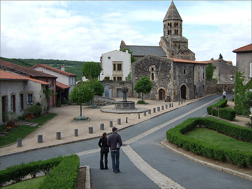

 Imagine if you will, if a 15 year old played grand theft auto (which is illegal since it's a certificate 18 game; but nevermind, most adults are really 15 year olds inside a grown-up's body) and thought "The action bits are fun but I don't want to have to deal with all that other crap."

I've only played little of Saints Row 2, but it does feel like the developers played GTA and thought, hmmnnn... It doesn't go quite over the top enough. After breaking out of jail (the tutorial) - which incidentally includes shooting police boats and choppers with a SAW from the back of a speeding boat\* the next mission is to free your former gang member from the courthouse. This of course involves ploughing through dozens of police and innocent bystanders. I particularly liked the judge judy-esque judge with a shotgun.

Where GTA (4 anyway) tries for some semblance of gritty realism in the storyline (outside of the action sequences) Saints Row 2 completely ignores all that. So instead of "Drive to point 'A'; view a cutscene with a 30 second explanation of why gang B is fighting gang C and a surgical strike against person D to collect item E" you get  "Yeah, whatever. Here's a bunch of guns and infinite grenades. Go and blow up as much shit as you can in 3 minutes. Don't worry if you fail". I have this mental image of a sales rep pitching it with ["It's GTA, but it goes to 11"](http://www.youtube.com/watch?v=EbVKWCpNFhY). It's unashamedly gory and ultra-violent. Which is nice but we'll see how long the novelty lasts and if it actually stays fun.

This complete disregard for reality is actually more comfortable for me than the faux reality of GTA4. With GTA4 I found myself looking at [Nico Bellic's](http://en.wikipedia.org/wiki/Nico_Bellic) character and while I can understand his choices I can't sympathise with them. I get it, it's a video game. It's not real life and the entire storyline is just a means to get you into action situations. But this guy arrives in a new country and I as his controller have no choice but to start a life of crime (in the game). If it's really a free form game why can't he apply to join the police or just get a regular job? Yes I know he's an illegal immigrant with a particular skillset and a dubious past, but I'm trying to point out that you don't really have any choice as to your actions in the long run (apart from that option to kill or not kill a particular character which as far as I can tell only determines whether you work with or against a particular gang).

It would be interesting (or incredibly boring depending on your point of view) to try and play the game without breaking the law. Take a job as a taxi driver (ok, you'll have to carjack that first car unless there's one parked in your cousin's garage) and do your best to just make a living from fares. How long could you go without being forced into illegality? Maybe the whole game is a commentary on the lack of choices available to illegal immigrants? I guess the market to buy soul-crushingly depressing games on the futility of struggle for the socially disadvantaged is kinda limited.

Gameplay-wise my only major complaint is the car physics. Maybe it's just me but they're incapable of driving in a straight line and overreact massively to the slightest change in direction. It could be that there's a driving skill you need to improve, it could be a design decision to make driving more 'interesting' or it could just be that I'm no good at it. Either way it grates slightly.

Also the controls are a little fiddly but this may just be because my muscle memory is tied to the (slightly different)GTA controls.

\*I don't remember the tutorial mission from GTA4 but I do do remember the opening cinematic from the boats and dock as well as the neverending drive with that cousin who wouldn't shut up. In terms of setting the scene it's not particularly memorable, though I suppose it was all about the slow build up and not intimidating the player.

Image is from flickr user [Titanet](http://www.flickr.com/photos/titanet/).
