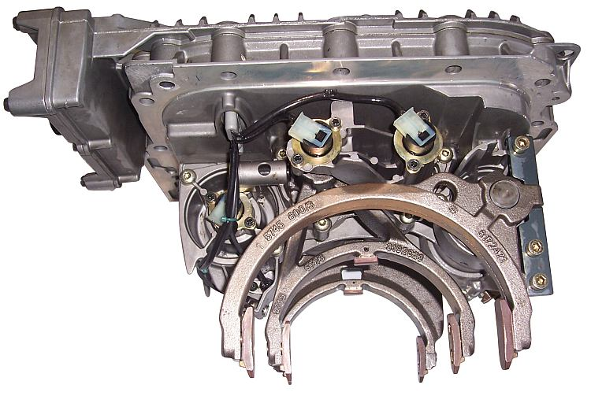

And this is what happens if you're doing SQL and then get shunted up into procedural code and then back down again.

In C#:

- you have variable names like local\_Variable\_Name instead of localVariableName.
- The fact that you can call methods without prefixing the name with EXEC seems... just, wrong.

In TSQL

- you keep on forgetting to use SET before variable assignment.
- the fundamental set based versus procedural programming approaches which means that fast running procedures become very, very slow when you get them wrong.

oy vey. The trials of a generalist.

<meta> Having great big images and cleverly formatted text is great for show and all but it does mean that I'm not posting as much as I'd like, so, I'm going to try and set up a separate Articles section for longer/better posts and have a the usual blog style on the front page. </meta>

image from [wikimedia commons](http://commons.wikimedia.org/wiki/File:I_shift_gear_change_unit.jpg?uselang=en-gb)
