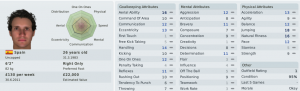
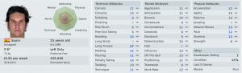
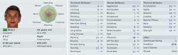

_"Señor Murphy, we heard that you used to play football. Maybe you'd be interested in a position which has just become available?"_ Paper finger wipes litter the floor, crackling underfoot as patrons talk at the bar. Gesticulating and loud, their coarse Spanish tobacco smoke curling up into the air with every exclamation. Behind the bar, a bear of a man stands with his white shirt open over an old vest, sleeves rolled up as he wipes glasses. A fly crawls on his shoulder.

_"Our previous coach has decided to... ahem. avail of gardening leave."_ The speaker is wearing a lightweight suit. One of his feet keeps tapping nervously. As his face betrays the desperation he is trying to hide. He knows that the club, his club, have a unexpected opportunity to excel due to the administrative relegation of Lorca Deportiva CF. There is also the danger of overreaching and bankrupting the club. This is the pressure which their previous manager could not deal with.

_"We have a great team, fantastic supporters and excellent facilities. I know that you are holidaying is would be much appreciated if you would consider the joining us a manager"_ Moratalla, a municipality of only 8,500 people, a city of only 5,900. They wanted me to lead their team to, well, not relegation. On a £1200 per week contract I'd be happy to lead them just about anywhere.

The following day I pull into the clubhouse and start basic manager due diligence. Financials, staff, facilities and prospects. The total wage budget is only £4993 p/w with no transfer budget. The financials I find say the bank balance is £0. Which while it's not good, at least I won't have to deal with debt. Any players I sell, I get to keep 10% of the value. That's not so good. Time to talk to the backroom staff and then see who we've got playing for us.

First though:

**Raul Abdesalam** my Assistant Manager. A fine tactical mind and good at maintaining discipline but I think it best if we stay away from the training pitch hmmmn?

Our other coach, **Rubén Gonzalo** isn't much better. Not bad with kids but not actually able to coach much are you.

Scouts - **Domingo Montero** is so bad I'd be better throwing darts at a board. And the physio? Has a physiotherapy rating of 4. From 20. Loads of fun I'm telling you.

Now on to the players. I'll just highlight who I think are the better players.

GK: **Ancor**. Is actually not that bad. Not great, but absolutely fine at this level.

GK backup: **Rodrigo De Paz** is transfer listed and is wanted by some other team. Looking at his stats I'm not sure why they want him, but I'll be happy to get him off the wage bill. **Luis Pérez García** is a promising 18 year old goalie. Probably will be good enough for this league in time but if we're getting promoted, he'll have to go.

RB: **Daniel Leon**. Relatively good. Suits my style of having at least one attacking full back.

LB: **Pablo**. Badly needs replacing. Fast (pace 14) and hard working but he can't defend, can't tackle and can't cross the ball.

CB: **Marquinhos**.  Again, not too bad. A Brazilian import with huge influence. I'm hoping he'll be my captain once he picks up some Spanish.

Other defenders: **Florea Iacob** (CB) is a physically imposing Romanian (again, no Spanish); **Pau** (CB, DM, MC) is another physical player and will probably be called in for cover in those positions; **Javier Rivero** is a very fast but technically poor 30 yr old right back

Wingers: **Adrián Martínez** (AM RLC), **Carolos Caballero** (AM LC) and **David Fernandéz** (AM R, FC)are fast but no technique while **Luis Miguel Girona** (MR) isn't physically impressive but technically better. **Iñigo Otero** (AM RL) is an out of contract 16 year old who looks promising, fast and can cross the ball (kindof).

Central Midfielders: **Juan Jésus** is physical and hard working but lacks any tackling, passing or technique. And he's currently my first choice. His partner **Asier Gasparo** is even worse. The only backup is **Pau** and a youth teamer (**Ismael**).

FC: **José Antonio Díaz** Ruiz is a nippy 6'1" forward who can't jump; **Rubén** is a strong, fast, 5'11"  striker with loads of flair and a finishing just creeping into the double digits.

Behind those two strikers we've got **Antonio Calderon** who might actually be better than **Rubén** and **Pedro** who is barely out of the youth team.

Outside that we've got a bunch of kids and no reserves. I know I've glossed over a lot of players, but that's because I don't think they'll be playing a large role in the progression of the team.

Tactically they seem to be set up in a 4-4-2 and there's a good spread of cover for all positions even if the quality seems to be lacking. I bravely tell the board that I'm aiming to avoid relegation, call Raul Abdesalam into my office and we  start looking a lists of unattached players.
