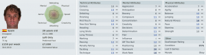

Here is an interesting quirk of how the Spanish league is organised; You play everyone in the first half of the season. And then, you play them all again, in the same order in the second half. It's somewhere between brilliant and lazy. Brilliant because it gives you a really good indication of how well you've improved or worsened over that time. Lazy because it's such a cop out from a scheduling point of view.

So for example, if you got five points from your first nine games, then anything above that would surely be an improvement and below that would be a drop. Switching from home to away would have an effect but over the time period surely it would even out.

First up, **Águilas CF**. The first team we played and lost to in the league. I'm determined not to lose the second time out. So to spice up the encounter I badmouth their coach in the press. Suggesting parentage of a goat or somesuch.

Unfortunately I've forgotten that my players a bunch of nice guys and they don't respond too well to that at all. 1-0 to **Águilas CF** in the mindgames.

The game kicks of and a barely fit **Calderón** earns a dubious penalty. Falling over in the opponents area, in the rough vicinity of a defender. Encouraged by our enthusiastic fan the referee points to the spot. Up steps **Daniel Léon** for his first goal ever for the club.

What follows is 85 minutes of time wasting, tight marking, slow paced, short passing, kick the opposition off the park. It's not soccer, it's trench warfare. One is **Iker** goal ruled out for a foul against the keeper and another goal for a dubious offside.

The stats alone will let you know how this went:

<table><tbody><tr><td>stat</td><td>Moratalla</td><td>Águilas</td></tr></tbody><tbody><tr><td>shots</td><td>3</td><td>9</td></tr><tr><td>possession</td><td>41%</td><td>59%</td></tr><tr><td>fouls</td><td>17</td><td>11</td></tr><tr><td>yellow cards</td><td>5</td><td>0</td></tr></tbody></table>

I was absolutely delighted. A victory for anti-football if ever there was one. It was more satisfying than a 5-0 thrashing and it gives me a positive feeling for the rest of the season.

Then I see the injury table and realise that our best striker, the one player which has reliably raised the performance of the team every time he's played, is out. **Calderón** will be injured for 3 months with a dislocated shoulder. He has been by far our best striker but I'm coming to realise that he is very injury prone and that I can't really rely on him over the course of a season.

During the second match my much maligned winger, **Nauzet Martínez** scores a great goal. Coming in the wing to slot it past the keeper. If he keeps on playing this well he might just be getting another contract. The game ends in a draw. Then I notice the opposition. **Roquetas** are second in the league and should really have beaten us easily. Even if we're not hammering in the goals, at least we've become a harder team to beat.

I looked around the upper league teams and asked **Barcelona** for a loan of one of their youth players. Predictably I was turned down. They were probably worried about all the bad habits I'd happily teach him. Sly fouling, defensive tactics, slow paced long passing games. I realise we're the anti-Barcelona but I don't care as long as we stay up.

Something was bothering me since the first match. Something about **Daniel Léon.** And yes, right there in his profile "Left foot only". Great I've got a left footed right back. No wonder he's having problems crossing into the box when he's coming forward. I look into cross training him to left back and start looking for replacement/backup right backs.

In an idle minute I make the mistake of looking at our financials. We're sinking further and further into debt with little to no income to match our outgoings. If things continue like this until the end of the season we'll be somewhere in the region of £200,000 in debt with no prospect of improvement. I'm definitely going to have to resolve this somehow.

Our third match is a bore draw which I'm happy enough with.  More significant I hope is the arrival of a new left back **Armiche.** His defensive and physical stats are solid enough. But it's the workrate of 16 and teamwork of 20 which put him over the top. He's 29 now so I hope to get 2~3 good years out of him.

We win our 4th match 2-0. Absolute deadlock for the start of the game. I was delighted with our backs (particularily **Armiche** who looks excellent already)  who barely let a shot in all game. Satisfied that they weren't going to score I switched to 442 with 30 minutes to go and **José** put in a fantastic header from outside the area as their keeper rushed out. **José** then linked up with **Rubén**, flicking on a header in a classic little and large goal.

There followed a 0-2 loss. We gave away an early goal and then when we were chasing the game we conceded another on the break

The 6th game was against Poli Ejido. I'm not sure what that translates to but judging from the colour of their strips I'm guessing "rotten egg"? Again this was fizzling out at 0-0 when with 15 minutes to go they have a player sent off. We changed to a 424 and tried to overload them. Long shots, crosses into the box all trying to eke out a chance but it still ended 0-0. Again **Armiche** played very well and really dominated all across the back line. I'm beginning to think that at this level of game decent physical stats combined with high workrate and teamwork is a winner.

The 7th game was another draw 0-0. A very tight game. I check the league table for the first time in weeks and I see that somehow we're up to 14th. I finally get the first sense that we might actually stay up. This of course means that we have to lose our next match. No hope can go unpunished by the cruel mistress that is fate.

8th - waterlogged. We have an artificial pitch in the south of Spain, how exactly can it get waterlogged? Really?

The real 8th game is a letdown. We're 0-2 down by half time with barely a shot in it. I give instructions to the players to "not worry too much" and give some of the fringe players a run out. It ends ups 0-4. After the game I'm talking to the press and I make some comment along the lines of "we didn't have much of a chance anyway". Now most of the players in the team don't react but my young winger **Otero** is all upset that I'm not showing more ambition. I'm starting to like this guy more and more. Ambitious, skillful and no whining. Exactly the sort of player we need to bring the club forward.

Before the 9th game the press is complaining that haven't scored in the last three games. Deciding to switch the tactics to something more attacking I go for a  442 counter style with **José** and **Fernando** up front. A fine 1-0 victory follows and all of a sudden the 0-4 loss is forgotten about.

So in summary:

- 9 games played
- 2 losses
- 4 draws
- 3 wins
- 13 points out of a possible 27

This isn't great but it's a massive improvement over the first quarter of the season and even if there's still a while to go yet, this one period of matches should have been enough to make sure we won't be relegated.
