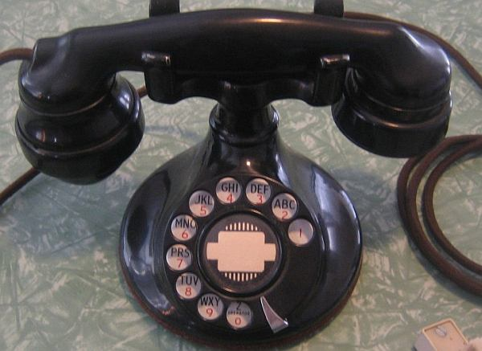

It always starts with a call.

_"Hello?"_

A bluff voice booms out of the handset. _"Eoin me old mate, I hear you're doing great things with that local team of yours"_

_"Um.. Thanks? I'm... I'm sorry, who is this?"_

_"Kieth Cooper, general director of Blyth Spartans Football Club. Listen, we're stuck for a manager and our first choice isn't available. Now I've been keeping an eye on the Irish West Cork Pub Leagues and I see you've managed to avoid relegation for the last five seasons. So I've decided to offer you the position of manager... "_

_"Uh... what? I think  you might have a wrong number Mr. Cooper. I'm a software developer not a football manager."_

_"Hah! 'Mr. Cooper' was my father. You just call me Kieth. Anyway I got this number off the googlenet and I can tell from your voice that you're the very man I'm looking for. If you want the job I have a contract here with your name on it for £425 a week over two years. Of course we'll also take care of any reasonable expenses..."_

_"Thank you very much. I'd love to, I mean I've played loads of Football Manager and I'm not bad at five a side but I'm afraid I'll have to think abou..."_

_"It's yes or no right now Eoin"_

_"Then yes."_

Apparently I'm on my way to [Lacedaemon](http://en.wikipedia.org/wiki/Sparta).

So yes, yet another play log of a Football Manager game told half as an in person narrative and half as a game review. As with the [Tale of Moratalla](http://spurious-logic.net/?cat=24) I'm playing Football Manager 2010 on a large database with no modifications, fake players with hidden attributes. There is no cheating and again, the primary purpose is to write it up in an entertaining manner.

The differences:

- In this game I have included **more playable leagues**. Which are England to Blue Square North and the top tier's of Holland, Spain, Germany and Italy. I did this because I've noticed that if you only have one playable league, then inevitably that league becomes predominant over all the others. Hopefully having them as playable leagues will help avoid this.
- The **lose conditions** are:
    - relegation of a club
    - bankruptcy of a club
    - non-promotion if in the same league for three years
    - being fired by a club
- **Can change clubs** if offered the job.
- Win condition is **winning the national treble** or **national league and champions league**…
- **More in-depth reporting of games**. No racing through seasons.

* * *

Telephone Handset image from [wikimedia commons](http://commons.wikimedia.org/wiki/File:Western_electric_201_telephone.jpg?uselang=en-gb)
