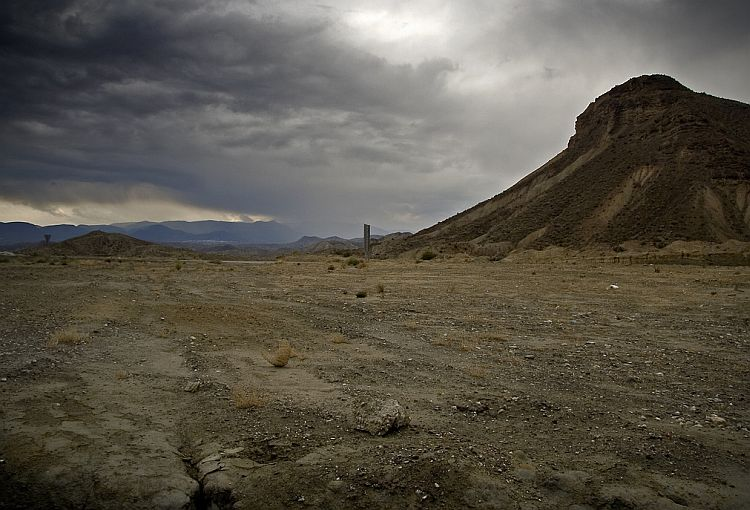

We are a reserves team. Part timers playing pretend against professionals who weren't good enough for the big leagues or kids who have yet to make it big. This alone reinforces the brutal hierarchy of competence. _"You below us, you are not good enough to best our cast offs and rejects. You cannot improve, you cannot better yourselves. Your entire purpose is as a proving ground for us to use."_

This puts into perspective the hubris I had when I took this job on at the start. The belief that a team, properly organised and motivated could beat the odds and climb back up the table. That amateur players could climb the leagues. Maybe that is possible; I certainly didn't organise right or motivate enough.

Here is how the tale of Moratalla ends.

The first two games are a travesty. Initially we are leading VillaReal 'B' the 4th placed team with **Gavlez** and **Cases** bossing the midfield only for our right back **Julio** (**Daniel Léon** is injured) to be sent off and then a blatantly offside goal is allowed against us. We lose 2-1.

In the following game we're two nil down by half time. **Inglesias** has reverted to his non scoring form. All I can see that would prevent him from scoring is his low bravery. With one on one's he gently rolls the ball to the keeper and if there's a defender nearby he doesn't even risk swinging his leg. Is he so frightened of attention or injury?

**José** manages a consolation goal but we still lose 2-1. As our crosses never seem to connect (I remember a single goal coming from a cross from wide all season) I've instructed my wide players to never cross the ball and try and work it into the box.

We win the third game thanks to a penalty to climb to 18th. As an aside, if you're fouled, resulting in a penalty which is converted; you get credited with an assist. No exactly what I would call an assist but if dem's the rules.

Our fourth game was against a fellow relegation contender. We concede after just three minutes and spend the rest of the game firing long throws and shots into the area. Loads of pressure but no goals. We lose 1-0.

I'm furious with the team. They were complacent even though we are in the relegation zone. Lazy and ineffectual. As MR's Giles & Dunphy would say, they "Lacked Moral Bravery". I'm not sure what what means but I let the team have it afterwards. Hopefully they got it because we have only 6 games to save the team from relegation.

I rant to the journalist that we weren't awarded a clear cut penalty and for the first time ever I'm handed a FA fine. Only £240 but still.

Looking at the table we're stuck in 19th but still only four points from safety.

The next game is the Valencia 'B' team or Valencia Mestalla as they are called. We take the lead as **José** chases a long ball over the top straight from **Ancor** and scores. Shortly after half time we concede another soft goal and as the game is drifting away **José** pops up again in injury time to win the game 2-1

We lose the **Jaén** game. At nil all at half time I tell the players to "Do it for the fans!". All 47 of them who've shown up. As we're playing fantastically, creating chance after chance,  we of course go one nil down; pull one back and go on to lose to another injury time goal.

We're 17th again, just in the relegation spaces and now we're playing the 19th placed team. We can't even beat them. **Ancor** has seen the writing on the wall and plays out of his skin in his first man of the match performance to keep us at nil all. I can't help but think that he's playing for a transfer.

At this stage, I'm sick of dealing with the press. Always the same questions, always the same answers and any deviation means that my squad is unhappy. So I send in my assistant. We lose the next game 4-1. In one incident which sums up his entire  season **Iglesias** is shoulder to shoulder to the right back, outside the penalty box. The ball comes to rest near the touch line. He starts to run with the defender towards the ball and I would say he's favourite to reach it even. And then he stops running. Just, stops. Not injured, not distracted just frightened that he might actually get the ball. That he could be the focus of attention.

After this the we're assured a relegation playoff. I can't tell how I feel. I can't seem get worked up over this. I've tried putting the players under pressure; they run around like headless chickens and lose. I've tried telling them to relax; they don't put any effort in and draw. So this time, I say nothing. In a manner befitting the whole season, we lose 1-0 to a goal in the 89th minute.

And we're relegated.

The day after we're relegated 6 senior players request transfers which I accept.

Taking their lead I resign as manager.

Picture from Flickr user [Drown](http://www.flickr.com/photos/drown/)
