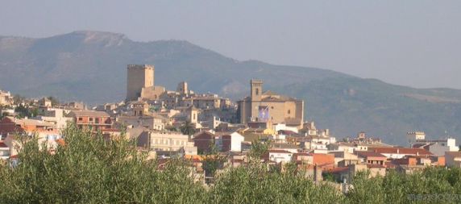

I've realised how to spot the teams which will cause trouble. They've all got really fancy crests.

Any team with complicated logo, usually incorporating some kind of animal or just lots of colours, and writing is a reserves team for one of the higher league teams. This means that their players, who aren't good enough to hack it in the next league up, are still far better than anything else in the league.

And to add injury to insult, they will never be promoted as long as the parent team is in the league above. So they're never going away. I suppose it's at times like this that I appreciate the Spanish roulette of which league you'll play in to help avoid all these fully professional squads.

I won't say it was a wild success and we'll have to improve on our points per game ratio if we're to do better than we did last year but so far the season has been going pretty well. I think a lot of this early season glow comes from the comparison with the awful, awful start to last season.

We've conceded badly on occasion but we've also been scoring which is nice. I'm sticking to the same defensive 4-5-1 formation which did so well for us at the end of last season. The focus on defence does mean that we can nick a winner every now and then. In short the first quarter went as follows:

- 9 games.
- 4 losses
- 2 draws
- 3 wins
- 11 points and in 11th spot

We lost the first game  0-1 against's the league leaders. I think they're the Valencia reserve squad. We were holding them level except for one very nice turn by their striker took him away from the defence and he slotted the shot. Later, we lost badly to worse positioned team. I was of the impression that we should win and I told the team before the match that  "I expect a win". My boys don't like pressure. Three goals down later and nary a pot shot at the opposing goal I get definitive proof of that.

Again **Inigo** (In ye go?) **Otero** has been our best player. Looking at his contract he's part time with a minimum release clause of £120,000. I issue him with a proper contract with a minimum release of £5 million. It'd be nice if someone bit on that. The striker, José has also performed well with quite a few goals and excellent overall play. Our Romanian defender, **Iacob** was playing very well at the back just got injured (out for up to 2 months) so my young Polish defender **Kowalczyk** will have a chance to shine. I'll probably have to rotate him and **Joe** (a.k.a. **José Antonio Rodrígruez Ruiz**) if he's not up to it.

As I said we have been scoring goal this season, which was one of our main problems last season. 10 goals in total with **José** on 4, **Otero** on 3, **Juan Jesus** on 2, **Daniel Léon** with one penalty. Unfortunately we've also conceded 10 goals as well. These have mostly been in the games we've lost, rather than the games we've won. i.e. Once we concede we tend not to get back into contention.

I think this is because of our playing style. If you're constantly defensive and you concede a goal then the opposition can just sit back and you're forced to go at them. We are a very limited team and we have real problems breaking down an organised defence. My wingers aren't great dribblers or crossers and my central midfielders don't have enough creativity or technical ability to work through the middle. My strikers tend to be of the nippy poacher or the tall beanpole varities and so they don't really link up with the midfield enough (though **José** is knocking lots of balls back to onrushing midfielders for them to hammer miles over the bar).

The great young hope, **Ingleias** hasn't played badly but neither has he scored. He's had a few chances but he's either had a terrible first touch or just not pulled the trigger. Looking at his stats his bravery's quite low. I wouldn't have thought that you have to be brave to take a shot but maybe you do. I still think that once he get's scoring he'll be fantastic but just needs that first goal. **Fernando** on the other hand hasn't had a lookin so I might start giving **Fernado** some game time to take the pressure from **Inglesias**.

I did see one of the best individual goals I've ever seen in football manager. Of course I conceded it. We were playing against and their striker picked up the ball on the right touchline 18 yards out. Sent my winger the wrong way with a dummy and took the ball to the byline. There he shimmied past my fullback and as the centre back was bearing down slipped it in at the near post where my keeper was standing like a statue. Of course I looked at his stats afterwards and apart from a ridiculous pace and acceleration his finishing, dribbiling and technique were all in single figures... Damn.

I must say that it already feels like we're not going to be relegated but I may have to revise my secret aim of "get promoted" to "qualify for Copa Del Rey" (i.e. top 5 spot or better). Judging on our performance against actual Liga Adelante (the league above ours) I shudder to think what would happen if we did actually get promoted.
