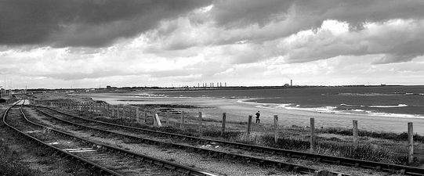

_Some players just want it more. They work harder in training, they stay longer and they're the ones busting a gut to make a difference come matchday. The thing is, they may be worse players than their more talented teammates but they'll still get picked first because you know you're going to get full effort from them whereas with as 'flair player' you don't know if they'll be an asset or a liability._

_Your water carriers, your linemen, your grunts are the core of your team. They'll play hard if it's against a newly promoted side or against the league leaders. They'll play hard regardless of whether they're getting £5 a week or £50,000 a week. They'll play hard in the bottom divisions and the top divisions These are the players you want. Luckily I've got some._

What do you do when your eighteen year old, "for the future" player suddenly trains up in all his stats\*? Get him back in the first team to maintain them or continue to rotate him as before? Take a look at [Steve Murray](http://spurious-logic.net/wp-content/uploads/2011/04/steve_murray_002.jpg) after just a few weeks of training. He's still not quite an automatic first team pick but that's a massive improvement over where he was. I haven't put him into the first team as I don't want to put him under too much pressure (and he's not good enough yet) but I'm going to use him as a sub more frequently and hopefully with those appearances and the infrequent starts those stat increases will stick.

\*yes, I understand fully that going from 1 to 2 in composure and anticipation is still shockingly, shockingly bad but it is still an improvement.

I'm going to need to find another centre back. Andrews and Hoyle can do a job at this level without being great and Joyce occasionally has an off game and just goes missing for ninety minutes. I worry that while they may cope in the next league up (The standard in the Blue Square Premiership really isn't that much better than the north/south leagues) once we get into the league proper, they'll be out of their depth. I've started searching and scouting for centre backs but, as usual, anyone who's worth having isn't interested. I'm thinking it makes more sense to wait until we're promoted and to then go trying to sign players. For now I'm just standing at the shop window with my greasy fingers pressed against the glass.

During some of the games I checked the motivation for Andrews and Hoyle I see that they both are marked as "complacent". They're certainly playing that way so maybe I need to give them more of a challenge rather than encouraging them all the the time and telling them what great lads they are and how "they can win this one".

I've been using a new left back on and off for the last few games as well. For once Coar and Davies manage to agree that [James Thompson](http://spurious-logic.net/wp-content/uploads/2011/04/james_thompson001.jpg) isn't good enough for the squad but he's got an average rating of 7.00 over the last 5 games. I know that, technically, he's crap and that this could just be a statistical blip but with those physical stats and determination he's doing better than either Richardson or Bowden in the same position. As long as I don't ask him to do anything beyond the basics of defend and stay back he's doing fine.

In fact, Davies was so pointless and irritatingly wrong that his comedy value couldn't compensate any more. So for £7,000 in mutual termination fees I happily dropped him between matches thirteen and fourteen. And I've signed a semi competent assistant manager, [Ricky Nightingale](http://spurious-logic.net/wp-content/uploads/2011/04/Ricky_Nightingale001.jpg). He's not as good a coach, but he is a better advisor. Plus he's only signed until the July 2010 so if he doesn't work out it's not such a big deal to replace him.

Match Reports

 

### Game 11: Gloucester 3-2

We're in 6th, they're in 7th so this is your stereotypical mid-table six pointer. After just two minutes Karl Jones (back from suspension) passes forward to McManus who turns his man to present a slide rule pass for Yates to run past his man onto and smash the ball past the keeper. 

Despite keeping up the pressure on Gloucester we concede a goal to a counter attacking move as Singh puts one past Earl on 23 minutes. The midfield got totally bypassed with a pass straight from one of their centre backs to Singh.

I change our tactics from counter attacking to just attacking, telling the players to get the ball forward, pass into space and I tell the fullbacks to look for overlap to provide extra width.

Of course, before half time they score again. This time Giddings rifles into the top corner as our midfield are go missing and the defence go to sleep.

At half time I put on Steve Murray and move Jones out wide right. On 53 minutes Murray sets up Millar and when their keeper saves Henderson is on hand to knock in the rebound.

On 66 minutes Henderson collects a cross from Dunlop (after a cross-field ball to him) and he manages to sqeeze in a shot from the narrowest of angles to bring us ahead again.

Not counting a few counter attacks led by Yates breaking away but failing to score the game has finishes with no major events.

### F.A. Cup 2nd Qualifying round: Cray 0-1

As we're playing a no-name team I decide to give the youth players a chance. Their one real player is Aka, a 34 year old central midfielder. Despite instructing the players to close him down and mark him tightly he manages to fire in a 35 yard goal midway through the first half. 

At half time the kids come off and Millar, Karl Jones and Henderson go on. I really can't afford to get knocked out this early so the big guns I was hoping to be able to rest have to play.

We hammer their goal for the entire second half, without a single shot from them but of course we go on to lose 1-0. I've told the team I'm angry at their performance, but really, I'm angry and myself for relying on unfit youngsters when the competition is actually important to the club. That's one revenue stream closed off to me for this year.

### Game 12: Alfreton. 1-0

The Alfreton players are passing the ball through our defence at will for the first 5 minutes, so I tell Grieve to tighten up on their passing central midfielder and that quietens them down. On 30 minutes we have a corner which breaks down but Millar retrieves the ball. Hoyle has stayed forward and receives a through ball and is onside due to a lazy full back on their part and scores his first ever goal. 

On 54 minutes they have a goal disallowed for offside. We were luck on that one I think so I take the opportunity to swap out Bowden for Richardson and other more defensive minded changes to prevent an actual goal.

These changes help calm the game down and apart from a few breakaway chances late on the game drifts away and ends 1-0.

### Game 13: Hinckley 3-1

Stevie Millar is off on his international travels again but makes it back in time for the game. My new assistant manager actually gives me a default "opposition instructions" which Davies was never able to provide me with. It helps to have competent staff. Eight minutes in and Dunlop absolutely _welts_ a cross in and it catches Jones on the side of the head, only to skip directly into the goal from around 20 yards out. It's his first goal for us but he had nothing whatsoever to do with it.

On 17 minutes there's  fantastic interplay between McManus, Yates and Millar. McManus picks up a loose ball on the right hand side of midfield and drives forward, passing to Yates. Yates dribbles into the left channel only to lay it off for Millar out on the left touchline. Millar picks up the pass and crosses from near the touchline to McManus who'd continued his run into the box to head home.  Great team goal.

At half time I shift Jones out right for Wright (who's knackered) and put Steven Murray in central midfield. On 64 minutes Murray puts in a beautiful chip over the defense and Jones cuts in from the wide right to finish it off. 3-0. The get a consolation goal in injury time which I missed as I was already in the dressing room and it ends 3-1.

The post match press now included BBC Leicester, The Hinckley Times and the ever present Non-League Paper. I can't help but think this means that we're going up in the world. It's a pity that they keep on asking the same inane questions and I keep providing the same platitudes as answers

### Game 14: Northwich 0-3

Despite my assistant managers expert advice they score in under three minutes. Wilkes dribbles slowly in the box and as I watch my centre backs and full backs try to tackle him. First sliding in one way in front of him and then sliding in the other way, all the time missing the ball and player so that he's left with a clear shot on goal. It was a well taken goal but defending was shocking.

On sixty minutes they score another goal in curtesy of a header off cross from all leading from a throw in. I can't help but think that it's time to switch both players and tactics, so I set make some substitutions and tell them to go all out attack

Their keeper has a fantastic last thirty minutes, making five or six fantastic saves (seemingly our forwards are unable to score when they're one on one with the keeper).

To round off the game they score straight from a header after a long kick down field from their goalie. Our defenders and goalie had a terrible game, their keeper was on form and our forwards couldn't score to save their lives. Some days the game just goes against you and you've just got to see where you improve and work from there.

### Game 15: Stalybridge 1-1

Stalybridge are 16th so I would hope we can beat them. I tell the team to attack and to get the ball forward without worrying about retaining possession. There aren't any real chances in the first half and at the start of the second half Joyce concedes a silly, silly penalty an we go 1-0 down.

Just as I'm making substitutions to deal with this, Henderson goes down injured so I tell Millar to play more as an "inside forward". Jones has been moved wide right to replace the knackered Potter. Millar proceeds to set up Jones for an easy tap in.

At the end I'm disappointed that it ended 1-1 but since we didn't look like getting anything from the game at 1-0 so I'm happy to take the draw.

### Game 16: Ilkeston 1-0

This was a very scrappy game which we dominate but it takes until the seventy ninth minute before we can score. Yates getting the goal again with an assist for Jamie Grieve.

Grieve wins man of the match and I've got to say that he's been playing very well since he's come back. Defending excellently as well as supporting the attacking players

### Game 17: Solihull Moors 1-2

Despite a win in the last game (barely deserved) I've got the feeling that we've been very flat for the last few games (a bad loss, a draw and a scrappy win) so I decide to change to a 4-5-1 and try for a more controlled play style.

We concede a goal direct from a free kick on nine minutes. It was a silly foul to give away but somewhat against the run of play. On twenty one minutes Ryan Bowden puts in a deep cross from the left which Wright nods in to make it 1-1. They score again on 35 mins after the defense doesn't push out and their striker, Hull, runs onto a through ball in the box.

Hoyle then gets sent of for two bad fouls so I stick Brown on up in front alone in a 4-4-1, in the hope that he can use his speed to steal a breakaway goal but no luck. Jones then gets himself sent off for another two bad fouls and with only 9 men on the pitch I'm clutching at straws...

### Game 18:Eastwood 1-1

After the débâcle at Solihull Moors we change back to a bog standard 4-4-2 and I tell the team to attack. Andrews scores an early goal, straight from a corner. The pitch is a beautiful white with snow covering the ground. Unfortunately Andrews lands awkwardly on the cold and hard pitch and he's forced off with an injury. Before the defence gets settled to the change in line-up, they equalise. They kill off the game with delaying tactics ends it 1-1 with no further chances of note.

### F.A. Trophy: Northwood 2-1

We're massive favourites and since my team tend to play complacently I tell them that I expect a win. We concede on 3 minutes. It looks like we're complacent but can't handle pressure.

I tell them to go for all out attack for the rest of the game and it still takes until the seventy fourth minute for Potter to grab an equaliser. One of their defenders went down injured under a heavy challenge from Yates and Potter finished up from the loose ball.

Potter then provided a great assist for Brown to score the winning goal on eighty two minutes. I had been playing 4-4-2 diamond attacking does the job with grieve playing out of defensive midfield. He defends well, distributes well and carries the ball out of defence. I just wonder if it'd work against better teams or would we be overrun in midfield?

### Game 19: Reddich 2-0

There are four players marked as 'severely lacking match fitness' in the starting eleven. On just three minutes in, McManus picks up a through ball from Yates and after stepping inside his marker he eventually finishes into the top corner.

On nineteen minutes and Earl pulls off a point blank save from a header. There are no real chances of note until the eighty first minute when Earl makes another fantastic save after Osbourne is through one on one on goal.

On eighty seven minutes there's a fantastic team goal. Dunlop and Jones combine to rob possession in midfield. Dunlop passes to Yates who's running into the channel towards the box. Yates then passes back to Henderson who looks like he's bearing down on goal but he delays long enough to draw in the two center backs and passes square along the 18 yard line to the unmarked Steve Murray who finishes beautifully into the corner.

### Game 20: Harrogate 2-1

On forty three minutes, Potter taps in the first goal after a defender misses a header from a cross. Lee Joyce then follows up on a rebound from a Jamie Grieve free kick on fifty nine minutes to score his first goal for Blyth. We manage to hit the post about 4 times in this 15 minute spell.

Feeling confident at two nil up and dominating the game I make some changes after the second goal. Straight away a header from Rose loops up over Earl to nestle in the back of the net on sixty one minutes. I can't help but think that his marker, Joyce, was still celebrating the goal and his concentration was shot.

One of the substitutions I'd made was to take Jamie Grieves off and there was a noticeable drop in performance throughout the team. Around the seventy fifth minute, Earl makes another fantastic save from a belter of a shot from outside the area to keep the lead. This seems to allow us to regain our composure and we dominate the rest of the game.

In the post match news I spot that it was a fan day and the chairman is delighted that we've produced such an exciting game to entice more punters to come to games.

### Game 21: Stafford 2-2

After conceding directly from a free kick after just seven minutes I go all out to attack. I tell the team to get the ball forward, the fullbacks look for overlaps and for the defence to push higher up the pitch. Our reward is Yates picking up a ricochet and running to towards the corner flag where he crosses for Henderson to nod home.  

In the second half, Wright passes short to Joyce from a corner. Joyce then wriggles and turns into space to put us 2-1 up. On eighty seven minutes a long pass into the box finds Hucker. His shot strikes the upright but the rebound bounces off of Earl's back and into the goal. An unfortunate own goal for the young keeper.

### F.A. Trophy First round: Dover 0-0

Back in the knockout competion of the F.A. Trophy I'm up against the Blue Square Premier league team of Dover. I try some mindgames by passing a comment on their star midfielder in this hope that the extra pressure will unnerve him. As it's the first leg of a two legged tie away, against 'superior' opposition I go against my instincts and set the team out in a defensive 4-42. I tell them to play with a slow tempo, short, controlled passing, a deep defensive line, narrow midfield to look to attack only on the counter.

The plan works to perfection and while Earl is busy throughout the game, they only really have long range chances. The only real shot of note comes on fifty eight minutes when a long range shot takes a deflection off a defender and bounces off the crossbar into Earls' hands. So it ends 0-0 and we climb back on the bus for the [360 mile, seven hour journey back up north](http://maps.google.com/maps?f=q&source=s_q&hl=en&geocode=FSksSQMdLPro_ylVP8SQMg1-SDGUMMw2v1lfIQ%3BFWktDAMdoQEUACn_MjNV0aTeRzFRSNdah1x4Mg&q=from+Blyth,+United+Kingdom+to+Dover,+United+Kingdom&aq=0&sll=51.608333,-8.537778&sspn=0.13795,0.262299&ie=UTF8&ll=52.562995,-1.252441&spn=8.646355,16.787109&t=h&z=6&saddr=Blyth,+United+Kingdom&daddr=Dover,+United+Kingdom) with the knowledge that it was a job well done.

What I love about the press conference is that they seem to get obsessed with a particular player that I rumoured to be interested in signing. I'm asked about signing Lee Williams every week. Again and again. I've no interest in the 34 year old right winger but the media keep on asking me about him. Every damn week. I've never scouted him nor is he on any of my shortlists. I can't help but think that there's a conspiracy by Mr. Williams' agent to drum up interest in his client.

During these games, I spotted a really good fitness coach who I thought was available. I then sacked my current fitness coach to make room for the new signee and when I went back to the new coach I was not able to make him a contract offer as he's retiring. _Lesson learned?_ don't sack your current staff without having offered contract to replacement staff.  Luckily, there was another excellent fitness coach available and willing to sign up.

I'm still scouting for players. I particular, centre backs, wingers and forwards. My short list includes many players who'll never even glance at us until we're at least three divisions higher and it's ballooned to over 300 players so I trim out anyone who's either too good or not good enough and get it down to a manageable 50 or so. My hope is that once I'm getting promoted I'll be able to cherry pick the better players from this division so I'm keeping tabs on who's playing well.

Just to illustrate the quality of play at this level. During one of the games above, a cross field ball is missed by Bowden. Who scurries to recover the ball but miscontrols under no pressure. By the time he has the ball in possession, their right back is on top of him and when Bowden slips he takes the ball and launches an attack. Only a good stop from Earl keeps the score's level.

In another example, Mike Hoyle scored his first goal by being too lazy and unaware to get back into position after an attacking corner move broke down. But because he was in the 'wrong' place defensively, he was in the right place offensively. He was only played on because their left back was too lazy to push out and put him offside.

Normally I'm obsessed with maintaining possession but at this level, mistakes are so common that it makes sense to play the percentage game and punt it down the field. If there are going to be errors I'd rather it's at the other end of the pitch. So I've taken the approach of playing at a high tempo and telling the players to 'get the ball forward' on a regular basis. This goes against how I normally like to play but the players are used to it and it wins games so I'll stick with for now.

So, after all that, half way through the season, [we're third in the league](http://spurious-logic.net/wp-content/uploads/2011/04/league_table_q2_2009.jpg)

Image from flickr user [Phil Thirkell](http://www.flickr.com/photos/63008913@N00/)
