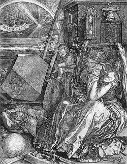

All of them.

So, sorry about that but I won't get around to fixing them until later.

How crap is that?

<edit>

And now they're back with no changes by me.

Stranger and stranger.

Image from [Albrecht Dürer](http://commons.wikimedia.org/wiki/D%C3%BCrer)
